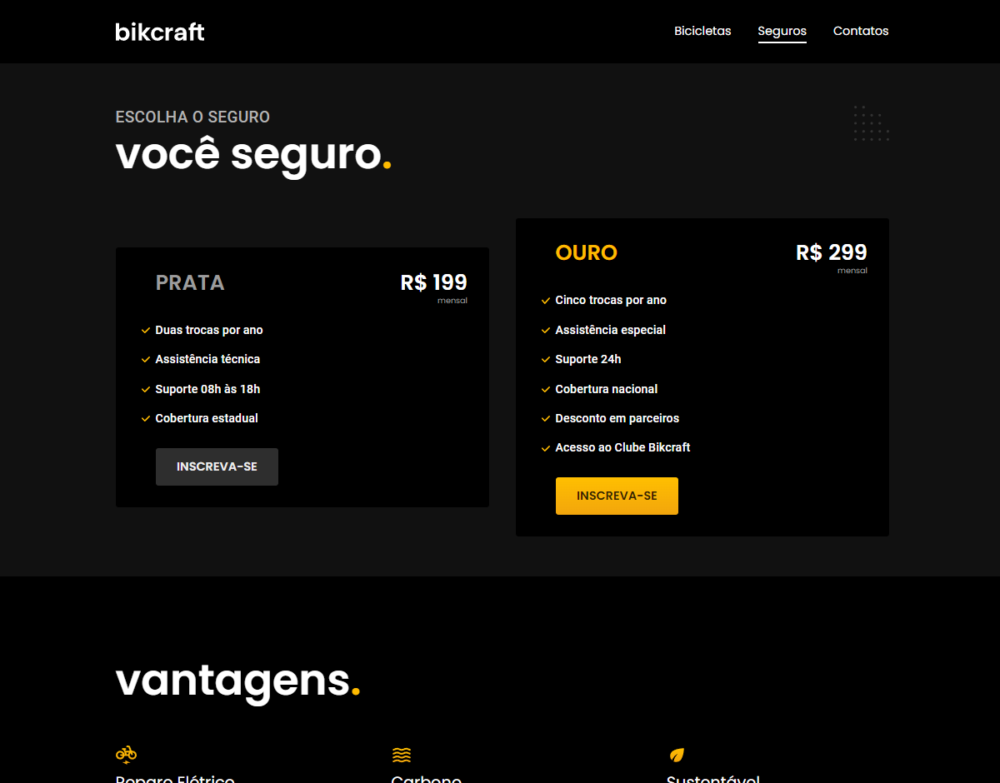
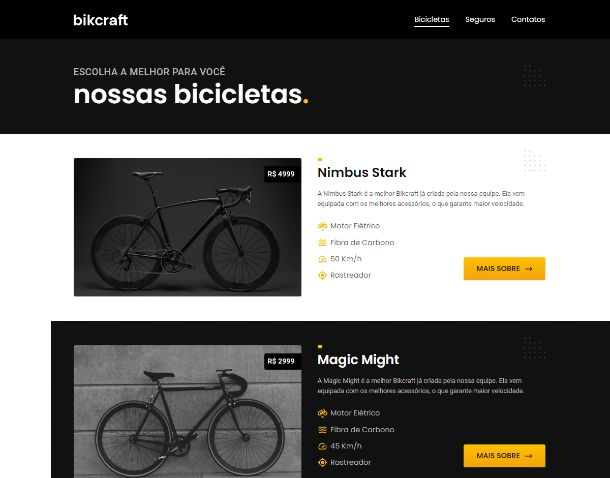
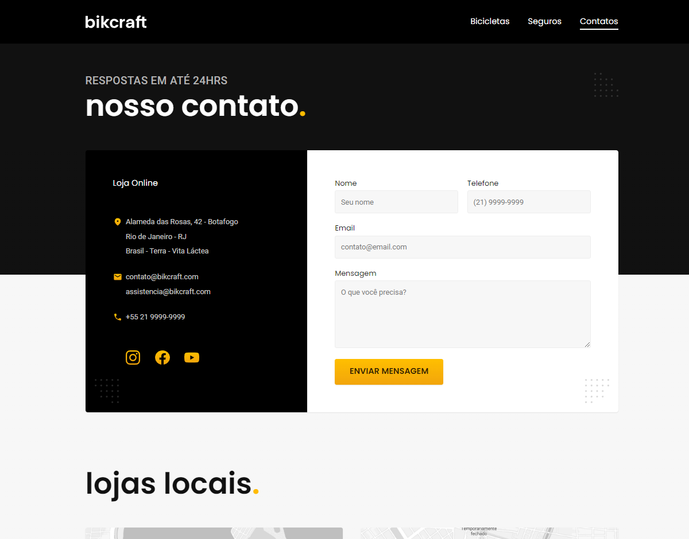
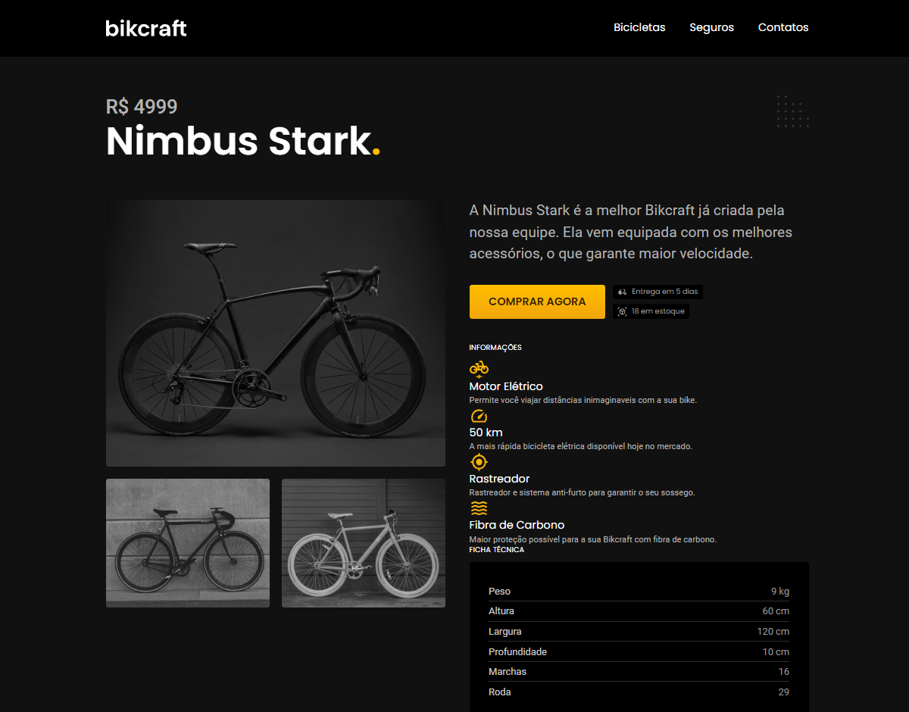
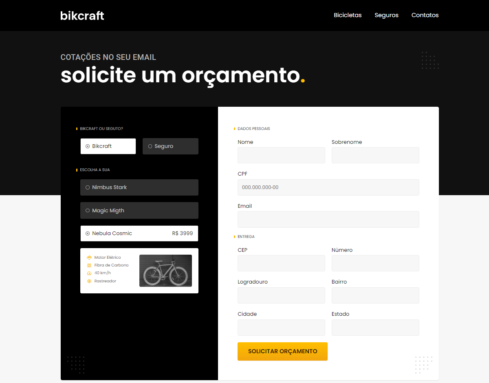

# Bikcraft | Projeto Origamid
Criado durante o curso de Front-End da plataforma Origamid, a Bikcraft é uma plataforma e-commerce para realizar venda de bicicletas elétricas e planos de seguros para as mesmas. O projeto possui 9 telas responsivas e padronizadas com o layout proposto.

Acesse o [e-commerce](https://bikcraft-lime-omega.vercel.app/)

## :art: Figma
Acesse o layout [aqui](https://www.figma.com/file/D1YjaQir34EHq1pT4Lfr2P/bikcraft-figma?type=design&node-id=0%3A1&mode=design&t=yL8vLU9Z435EwazC-1)

## :rocket: Tecnologias
* HTML
* CSS
* JavaScript

## :computer: Desktop
 
 
 

## :iphone: Mobile

